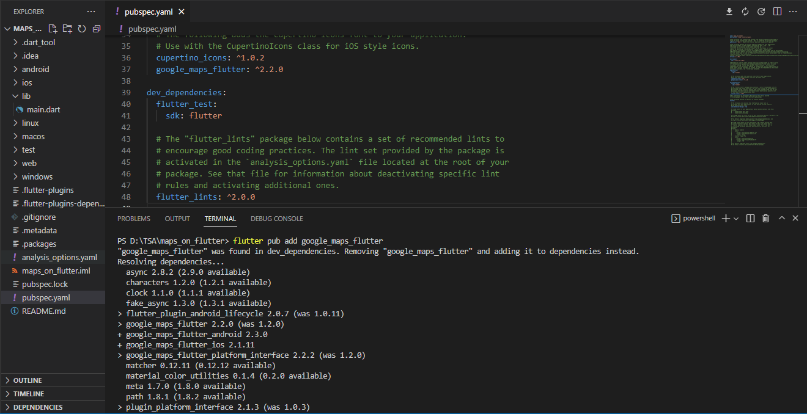
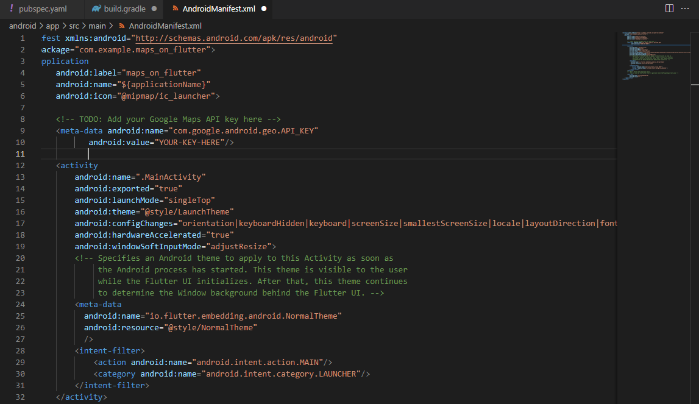
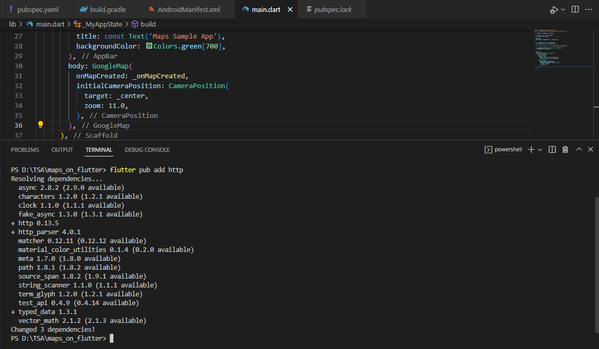
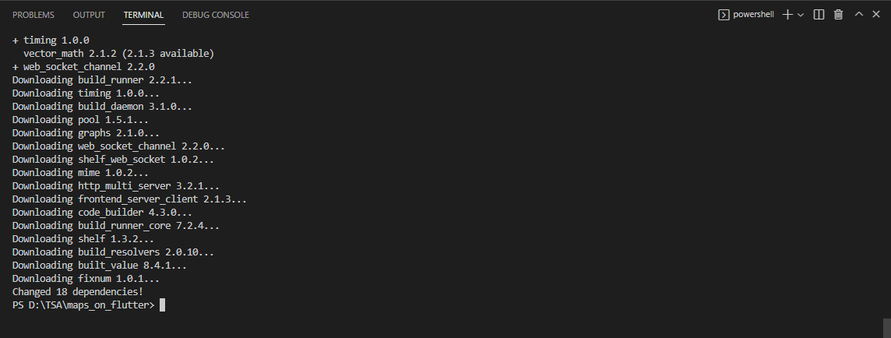
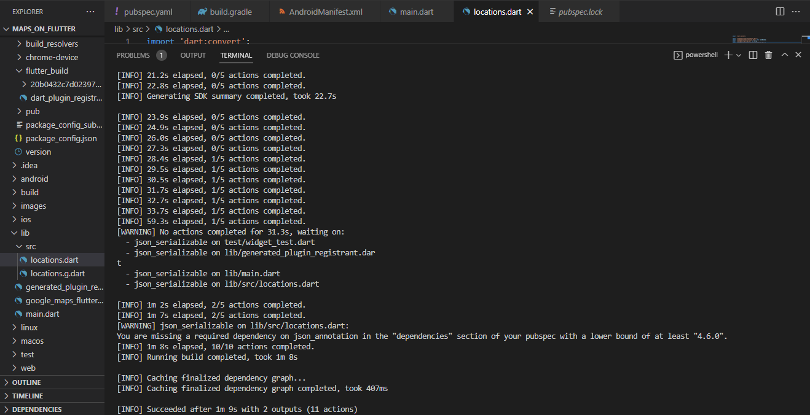
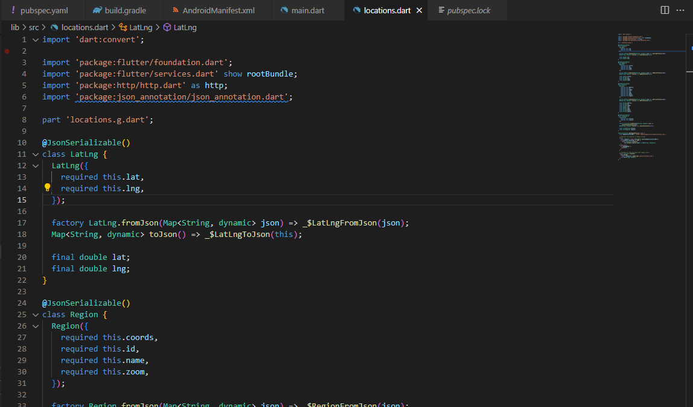
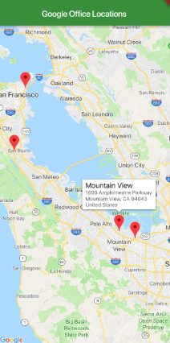

# maps_on_flutter

Baggio Deroger

1- Adding google maps plugin as a dependecy

2- Configuring the Android SDK:

3- Test running the application

4- Adding additional packages:
HTTP

5- Json & nuild_tunner

6- Create locations.dart file

7- Testing the app

8- Assignment:

